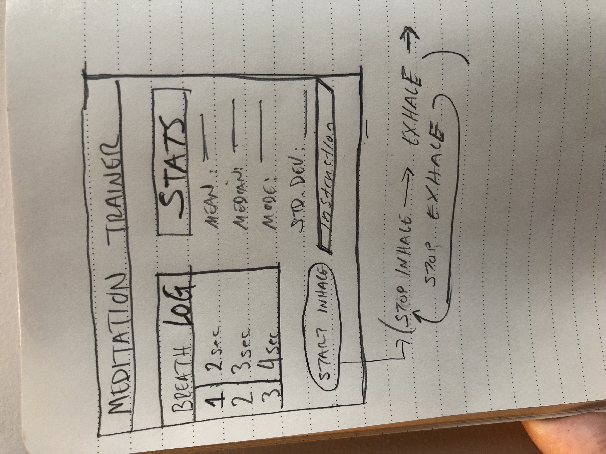

# Meditation Trainer

As befits someone with solid experience in HTML, CSS, and JavaScript, we're
going to give you a taste of the real world. It's entirely likely that, as
programming becomes a part of your career, someone will come to you with a
taco sauce-smeared napkin complete with a drawing of the app they want to build.
In that spirit, build this app:

## Well, a Few More Instructions

We didn't mean to frighten you! Take a few deep breaths (timely!).

Meditation is quite vogue these days as a way to achieve mindfulness and reduce
the stress of day-to-day life. We'd like to build an app that helps people
increase the lengths of their breaths. We've "interviewed" the product owner
and gotten their description of the app (in a very human voice!). Part of the
skill of this lab is learning to think like a developer and learning to read
between the lines of what people want.

> We'd like a button that says "START INHALE". You click it and in a neat little
> box next to it to types a small instruction like "Nice and easy, through the
> nose" or "Think of your mantra." Oh, the button should change its text. Oh and
> we only ever want one button, nice and simple. Anyway, you get to the top of
> the breath, lungs all full and they click the button that says, like, "Inhale
> done" or "stop breathing." They then click the button again and start an
> exhale. Button text should change, instructions too. Then click the button to
> mark all done and WHABAM! That breath should be added to a BREATH LOG. Also
> stats should be run on the BREATH LOG. Put some statsy stuff in there, mean,
> medium, mode, sigma, stuff like that.
